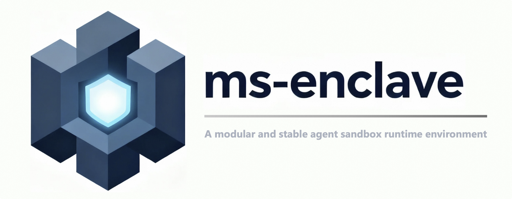

# ms-enclave Documentation

**ms-enclave** is a modular, robust sandbox runtime that gives your applications a secure, isolated execution environment. Backed by Docker for strong isolation, with local / HTTP managers and an extensible tool system to safely run code (including LLM-generated code) in a controlled environment.

## Key features

- 🔒 **Secure isolation**: Docker-based isolation with resource limits
- 🧩 **Modular**: sandboxes, tools, and managers are all pluggable via registry/factory
- ⚡ **Stable**: lightweight implementation, fast startup, pool warm-up supported
- 🌐 **Remote-ready**: built-in FastAPI server, identical API for local and remote
- 🔧 **OpenAI-compatible**: tool schemas plug directly into Function Calling

## Requirements

- Python ≥ 3.10
- OS: Linux / macOS / Windows (with Docker)
- A working Docker daemon; port 8888 must be free for the Notebook sandbox

## Where to start

### New here?

1. [Installation](getting-started/installation.md)
2. [5-Minute Quickstart](getting-started/quickstart.md) — one minimal runnable example
3. [Core Concepts](getting-started/concepts.md) — understand Sandbox / Manager / Tool

### By task

- [Pick the right entry point](guides/index.md): Factory / Manager / Pool / HTTP
- [Built-in tools](guides/builtin-tools.md)
- [Install third-party dependencies](guides/install-deps.md) / [Mount host directories](guides/host-volumes.md)
- [Notebook sandbox (stateful)](guides/notebook-sandbox.md)
- [LLM Agent integration](guides/agent-integration.md)

### Deployment

- [HTTP server](deployment/http-server.md) / [HTTP client](deployment/http-client.md)
- [Volcengine cloud sandbox](deployment/volcengine.md)

### Extending

- [Registration overview](extending/index.md)
- Custom [Tool](extending/custom-tool.md) / [Sandbox](extending/custom-sandbox.md) / [SandboxManager](extending/custom-manager.md)

### API reference

- [API reference](api/index.md) (auto-generated via mkdocstrings)

### Stuck?

- [FAQ & troubleshooting](faq.md)
- File an issue: <https://github.com/modelscope/ms-enclave/issues>
